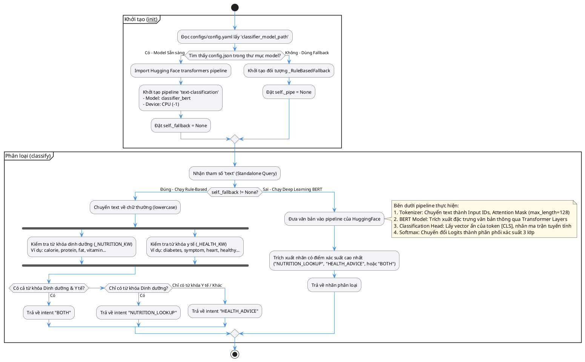
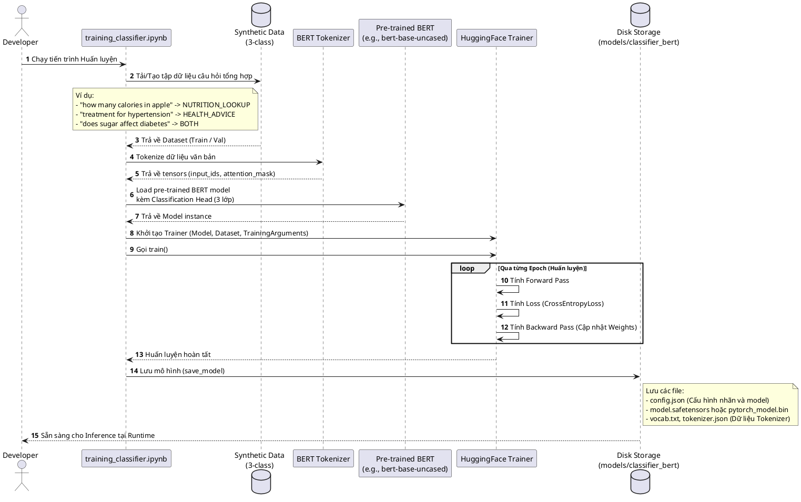
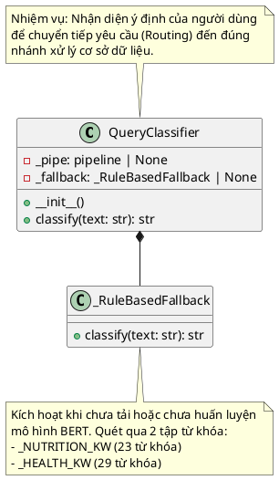

# HEALTHCARE-RAG Classifier BERT Workflow

Tài liệu này mô tả chi tiết cách thức hoạt động, kiến trúc lớp và luồng xử lý dữ liệu của cấu phần **Classifier BERT** (`QueryClassifier`) trong hệ thống **HEALTHCARE-RAG**.

---

## 1. Sơ đồ Luồng hoạt động của Classifier (Activity Diagram)

Mô tả chi tiết luồng xử lý từ khâu khởi tạo đối tượng, kiểm tra tính sẵn sàng của mô hình học sâu cho đến khi đưa ra quyết định phân loại ý định (Intent Routing).

---

## 2. Quy trình Huấn luyện Mô hình BERT (Sequence Diagram)

Quy trình chuẩn bị dữ liệu tổng hợp (synthetic data) và huấn luyện mô hình để lưu vào đĩa cứng trước khi chạy ứng dụng thực tế.

---

## 3. Cấu trúc Lớp trong Python (Class Diagram)

