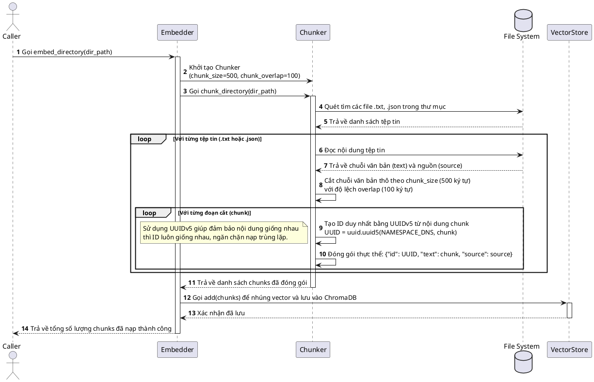
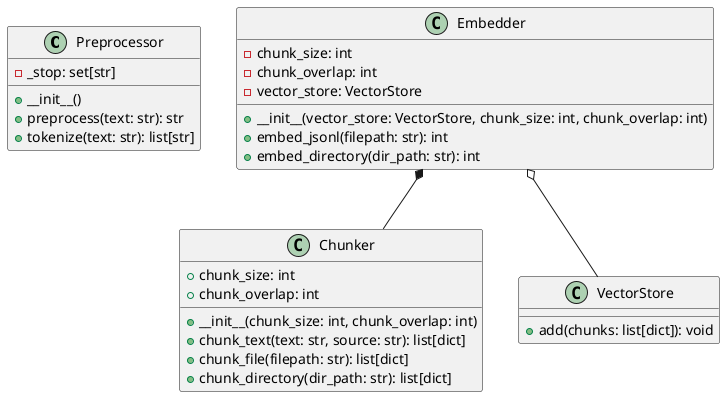

# HEALTHCARE-RAG Data & Preprocessing Pipeline

Tài liệu này mô tả chi tiết cách thức hoạt động, luồng xử lý và cấu trúc của cấu phần **Data Pipeline** (Nạp chỉ mục, phân mảnh văn bản) và **Preprocessing** (Tiền xử lý văn bản) trong hệ thống **HEALTHCARE-RAG**.

---

## 1. Sơ đồ Luồng Nạp và Cài đặt Dữ liệu (Activity Diagram)

Mô tả luồng tải tập dữ liệu y khoa **NFCorpus**, chuẩn hóa dữ liệu, lưu trữ vector vào ChromaDB và xuất file phục vụ BM25 (chạy qua lệnh `python -m src.data_pipeline.load_nfcorpus`).

```plantuml
@startuml
skinparam ActivityBackgroundColor #F2F4F7
skinparam ActivityBorderColor #333333
skinparam ActivityFontSize 12
skinparam ArrowColor #4A90E2
skinparam NoteBackgroundColor #FFF9E6

start
:Đọc configs/config.yaml để lấy tham số ChromaDB & Embedding Model;

partition "Tải & Giải nén (download_and_extract)" {
    if (Đã tồn tại data/nfcorpus/corpus.jsonl?) then (Có)
        :Bỏ qua tải dữ liệu (Skip download);
    else (Không)
        :Tải file zip NFCorpus từ URL máy chủ BEIR (~50 MB);
        :Lưu vào thư mục data/;
        :Giải nén file zip thành thư mục data/nfcorpus/;
    endif
}

partition "Xử lý & Nạp chỉ mục (load_and_index)" {
    :Đọc từng dòng của data/nfcorpus/corpus.jsonl;
    loop Cho mỗi bài báo y học
        :Gộp tiêu đề (title) và nội dung tóm tắt (text) thành 1 văn bản duy nhất;
        :Định dạng theo schema hệ thống:
        {
           "id": doc_id,
           "text": "Title\n\nAbstract",
           "source": "nfcorpus"
        };
        :Thêm vào danh sách tài liệu;
    end loop
    
    if (ChromaDB đã có dữ liệu?) then (Có)
        :Gọi vs.clear() để xóa bộ sưu tập (collection) cũ;
    endif
    
    :Phân mảnh danh sách nạp thành các lô (batch_size = 5000);
    loop Cho mỗi lô dữ liệu (Batch)
        :Tính toán Embedding vector thông qua SentenceTransformer;
        :Nạp dữ liệu (IDs, Embeddings, Documents, Metadatas) vào ChromaDB;
    end loop
}

partition "Xuất Corpus cục bộ (export_corpus)" {
    :Lưu danh sách tài liệu đã chuẩn hóa dưới dạng JSONL 
    vào file data/en/corpus.jsonl;
    note right
        File này sẽ là nguồn cấp dữ liệu cho 
        công cụ tìm kiếm từ khóa BM25 tại runtime.
    end note
}

:Chạy kiểm tra thử (Sanity Check) dòng đầu tiên;
stop
@endum
```

---

## 2. Luồng Phân mảnh Văn bản tự động (Sequence Diagram)

Mô tả chi tiết quy trình chia nhỏ bài viết y học/dinh dưỡng dài (Crawl thực tế) để đảm bảo độ chính xác khi nhúng vector (Embedding) và tránh mất ngữ cảnh.



---

## 3. Cấu trúc Lớp Tiền xử lý & Data Pipeline (Class Diagram)


