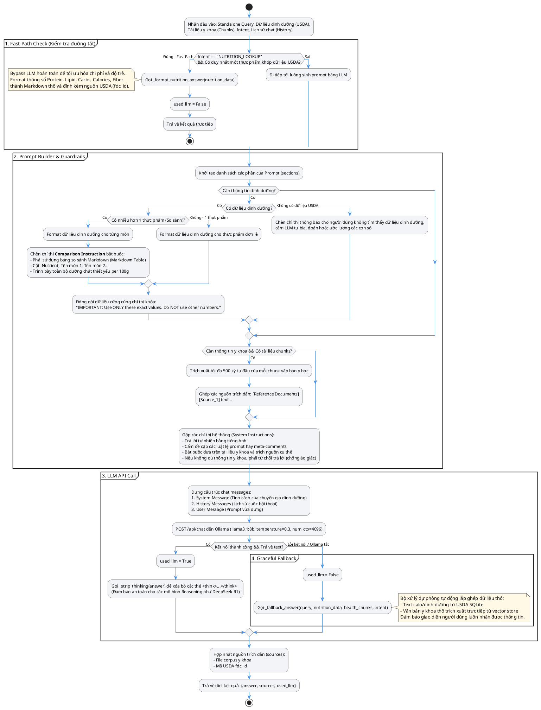
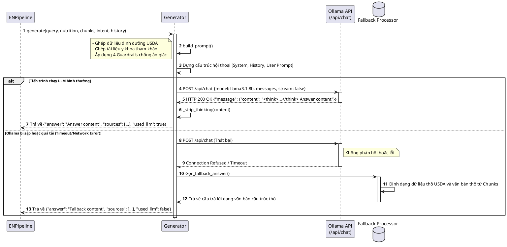
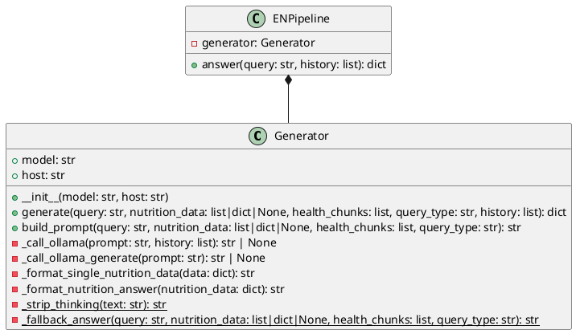

# HEALTHCARE-RAG LLM Generation Workflow

Tài liệu này mô tả chi tiết cách thức hoạt động, prompt engineering, kiểm soát an toàn dữ liệu (Guardrails), cơ chế đường tắt (Fast-path) và hệ thống dự phòng (Fallback) của cấu phần **LLM Generation** (`Generator`) trong hệ thống **HEALTHCARE-RAG**.

---

## 1. Sơ đồ Luồng xử lý Sinh câu trả lời (Activity Diagram)

Mô tả chi tiết cách hệ thống quyết định đi theo nhánh sinh lời giải trực tiếp (Fast-path), gọi mô hình LLM, hay chuyển tiếp sang cơ chế dự phòng (Rule-based Fallback).

---

## 2. Quy trình Tương tác với Ollama và Fallback (Sequence Diagram)

Mô tả sự tương tác giữa RAG Pipeline, Generator, Máy chủ Ollama cục bộ và cơ chế bảo vệ dự phòng khi xảy ra sự cố.

---

## 3. Cấu trúc Lớp Generator (Class Diagram)

