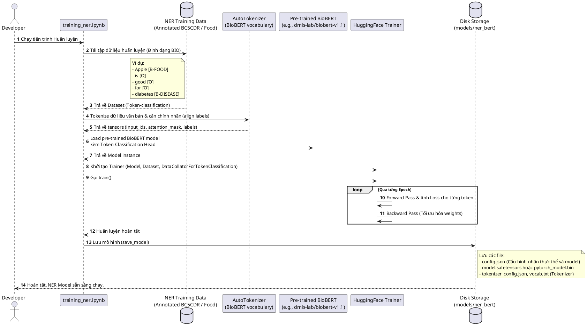
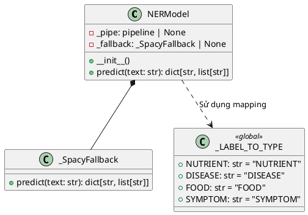

# HEALTHCARE-RAG Named Entity Recognition (NER) Workflow

Tài liệu này mô tả chi tiết cách thức hoạt động, kiến trúc lớp và luồng xử lý dữ liệu của cấu phần **NER Model** (`NERModel`) trong hệ thống **HEALTHCARE-RAG**.

---

## 1. Sơ đồ Hoạt động tại Runtime (Activity Diagram)

Mô tả chi tiết luồng xử lý trích xuất thực thể từ câu hỏi người dùng, có cơ chế dự phòng đa tầng (Deep learning -> Rule-based spaCy) khi xảy ra lỗi.

```plantuml
@startuml
skinparam ActivityBackgroundColor #F2F4F7
skinparam ActivityBorderColor #333333
skinparam ActivityFontSize 12
skinparam ArrowColor #4A90E2
skinparam NoteBackgroundColor #FFF9E6

start
partition "Khởi tạo (__init__)" {
    :Đọc configs/config.yaml lấy 'ner_model_path';
    if (Tìm thấy config.json trong thư mục model?) then (Có - Model Sẵn sàng)
        :Import Hugging Face transformers pipeline;
        :Khởi tạo pipeline 'token-classification'
        - Model: BioBERT fine-tuned
        - Aggregation Strategy: 'first' (Ghép sub-words)
        - Device: CPU (-1);
        :Đặt self._fallback = None;
    else (Không - Dùng Fallback)
        :Khởi tạo đối tượng _SpacyFallback;
        :Đặt self._pipe = None;
    endif
}

partition "Nhận diện Thực thể (predict)" {
    :Nhận tham số 'text' (Standalone Query);
    
    if (self._fallback != None?) then (Đúng - Chạy spaCy Fallback)
        :Chạy trích xuất dựa trên tập từ khóa cứng;
        note left
            Tách câu thành tập các từ đơn (lowercase).
            Giao tập hợp (&) với 4 bộ từ khóa cứng:
            - _FOOD_TOKENS
            - _DISEASE_TOKENS
            - _NUTRIENT_TOKENS
            - _SYMPTOM_TOKENS
        end note
        :Trả về dict các thực thể trích xuất được;
    else (Sai - Chạy Deep Learning BioBERT)
        :Tách từ đơn trong câu hỏi;
        if (Độ dài câu > 150 từ?) then (Có)
            :Cắt ngắn câu chỉ lấy 150 từ đầu tiên
            (Để tránh lỗi vượt giới hạn 512 tokens của BERT);
        endif
        
        try
            :Đưa văn bản vào pipeline BioBERT;
            note right
                Hoạt động bên trong BioBERT:
                1. WordPiece Tokenizer chia câu thành các sub-tokens.
                2. Chạy qua các tầng Self-Attention trích xuất vector ngữ nghĩa.
                3. Linear Layer ánh xạ vector token sang BIO labels.
                4. Aggregation 'first': Ghép các sub-tokens (ví dụ: 'di', '##abetes')
                   lại thành một thực thể hoàn chỉnh ('diabetes').
            end note
            
            :Duyệt qua kết quả trả về của pipeline:
            - Lọc loại bỏ trùng lặp
            - Ánh xạ nhãn BioBERT sang loại thực thể của hệ thống:
              * FOOD -> FOOD
              * DISEASE -> DISEASE
              * NUTRIENT -> NUTRIENT
              * SYMPTOM -> SYMPTOM;
              
            :Trả về dict kết quả;
        catch (Lỗi Model / Out Of Memory / v.v.)
            :Kích hoạt Graceful Fallback;
            :Gọi _SpacyFallback().predict(text) thay thế;
            :Trả về dict kết quả;
        end try
    endif
}
stop
@endum
```

---

## 2. Quy trình Huấn luyện Mô hình BioBERT NER (Sequence Diagram)

Mô tả quy trình huấn luyện tinh chỉnh (Fine-tuning) mô hình BioBERT trên tập dữ liệu y tế mẫu và thực phẩm (ví dụ: BC5CDR).



---

## 3. Cấu trúc Lớp NER (Class Diagram)


