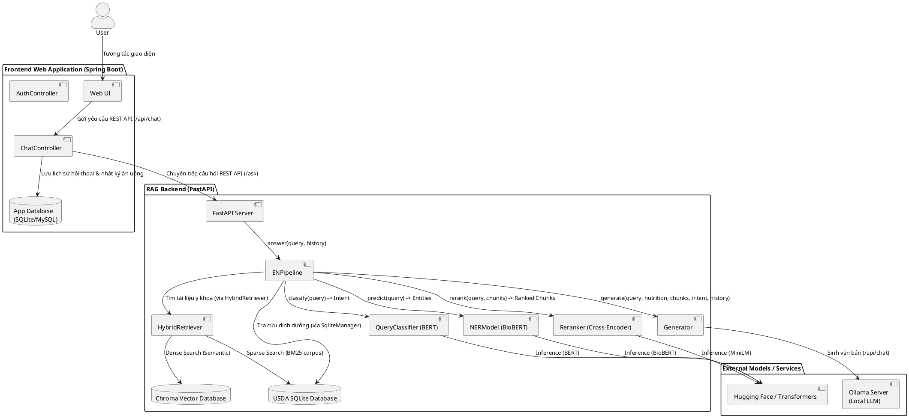
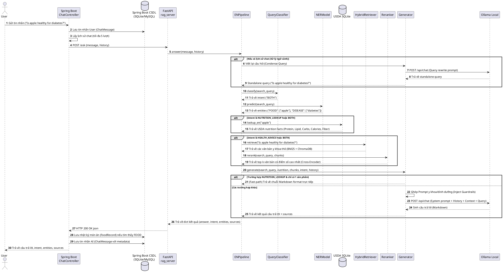

# HEALTHCARE-RAG Project Architecture & Design Documentation

Tài liệu này mô tả chi tiết kiến trúc, luồng xử lý dữ liệu và mối quan hệ giữa các thành phần của hệ thống **HEALTHCARE-RAG** - ứng dụng RAG (Retrieval-Augmented Generation) hỗ trợ tra cứu dinh dưỡng và tư vấn sức khỏe.

---

## 1. Kiến trúc Hệ thống (System Architecture)

Hệ thống được thiết kế theo kiến trúc phân tách rõ ràng giữa **Frontend Web Application (Spring Boot)** và **RAG Backend Server (FastAPI)**, tích hợp các thành phần cơ sở dữ liệu và mô hình AI chạy cục bộ.

### Biểu đồ Component (PlantUML)

---

## 2. Luồng xử lý yêu cầu (Sequence Diagram)

Quy trình từ lúc người dùng gửi câu hỏi đến khi hệ thống trả về câu trả lời tối ưu kết hợp giữa cơ sở dữ liệu dinh dưỡng USDA và các bài báo khoa học.

### Biểu đồ Sequence (PlantUML)

---

## 3. Mô tả Chi tiết các Thành phần trong Project

### 3.1. Frontend Web Application (`chatbot/`)
Được phát triển bằng **Spring Boot**, chịu trách nhiệm quản lý người dùng, giao tiếp UI và quản trị dữ liệu ứng dụng.
*   **Controllers**:
    *   [ChatController](file:///d:/Data/File%20for%20Google%20Drive%20real/Project/Nutrition_RAG/HEALTHCARE-RAG/chatbot/src/main/java/com/webdinhduong/chatbot/controller/ChatController.java): Điểm tiếp nhận tin nhắn từ giao diện web, tích hợp cơ chế phân tích lịch sử chat (tối đa 5 lượt nhắn gần nhất), gọi RAG API cục bộ, lưu trữ thực thể món ăn vào nhật ký cá nhân và lưu lịch sử chat vào CSDL.
    *   `AuthController`: Xử lý đăng ký, đăng nhập và bảo mật thông qua JWT (JSON Web Token).
*   **Entities (Models)**:
    *   `User`: Lưu thông tin tài khoản người dùng.
    *   `ChatMessage`: Lưu nội dung chat, vai trò (`user` / `ai`), ý định (`intent`), các thực thể (`entitiesJson`), nguồn trích dẫn (`sourcesJson`) và năng lượng của món ăn liên quan.
    *   `FoodRecord`: Nhật ký món ăn được trích xuất tự động khi người dùng hỏi về thực phẩm, hỗ trợ theo dõi calo.
*   **Security & Database Config**:
    *   `SecurityConfig` & `JwtFilter`: Cấu hình phân quyền truy cập API.
    *   `DatabaseConfig`: Cấu hình kết nối cơ sở dữ liệu SQLite của ứng dụng.

### 3.2. FastAPI Server (`main/rag_server.py`)
Là REST API backend viết bằng **FastAPI**, làm cầu nối trung gian giữa ứng dụng Spring Boot và Pipeline Python.
*   Khởi tạo `ENPipeline` thông qua cơ chế `lifespan` bất đồng bộ để tránh trễ trong quá trình tải các mô hình học sâu.
*   Cung cấp endpoint `/ask` tiếp nhận payload gồm `message` và `history` của cuộc hội thoại, chuyển đổi kiểu dữ liệu tương thích và chạy pipeline xử lý trong luồng riêng biệt (`run_in_threadpool`) nhằm không gây nghẽn máy chủ.

### 3.3. RAG Core Pipeline (`src/en/` & `src/database/` & `src/generation/`)
Trái tim của hệ thống xử lý ngôn ngữ tự nhiên và truy xuất thông tin:

1.  **Preprocessor (`src/en/preprocessor.py`)**: Chuẩn hóa văn bản đầu vào.
2.  **Query Condenser (trong [ENPipeline](file:///d:/Data/File%20for%20Google%20Drive%20real/Project/Nutrition_RAG/HEALTHCARE-RAG/src/en/pipeline.py))**:
    *   Giải quyết vấn đề đồng tham chiếu (Co-reference resolution). Sử dụng Local LLM (Ollama) để viết lại câu hỏi follow-up dựa trên tối đa 5 lượt hội thoại lịch sử thành một câu hỏi độc lập (Standalone question).
3.  **Query Classifier (`src/en/classifier.py`)**:
    *   Phân loại ý định của người dùng thành `NUTRITION_LOOKUP` (Tra cứu dinh dưỡng), `HEALTH_ADVICE` (Tư vấn sức khỏe), hoặc `BOTH` (Cả hai).
    *   Sử dụng mô hình **BERT** đã được fine-tune hoặc cơ chế fallback **Rule-Based** (phân tích tập từ khóa) nếu mô hình BERT chưa được tải.
4.  **NER Model (`src/en/ner.py`)**:
    *   Nhận diện các thực thể sinh học và y tế: `FOOD`, `DISEASE`, `NUTRIENT`, `SYMPTOM`.
    *   Sử dụng mô hình **BioBERT** fine-tuned trên BC5CDR hoặc cơ chế fallback sử dụng **spaCy** keyword matching.
5.  **SqliteManager (`src/database/sqlite_manager.py`)**:
    *   Thực hiện truy vấn dữ liệu cứng từ USDA SQLite Database (`data/usda_food.db`).
    *   Thực hiện thuật toán tìm kiếm gần đúng dựa trên các từ khóa (Keyword search), lọc bỏ các từ chung chung và sắp xếp ưu tiên các thực phẩm nguyên bản (`foundation_food`) so với các thực phẩm chế biến sẵn.
6.  **HybridRetriever (`src/en/retriever.py`)**:
    *   **Sparse Retrieval (BM25)**: Sử dụng thư viện `rank_bm25` để tìm kiếm chính xác các từ khóa y học trên tập dữ liệu corpus (`data/en/corpus.jsonl`).
    *   **Dense Retrieval**: Sử dụng ChromaDB để tìm kiếm ngữ nghĩa sâu thông qua nhúng vector embeddings bằng model `all-MiniLM-L6-v2`.
    *   **Reciprocal Rank Fusion (RRF)**: Hợp nhất kết quả từ hai phương thức truy xuất trên với hệ số điều chỉnh `k=10` để lấy ra các đoạn văn bản tối ưu nhất.
7.  **Reranker (`src/en/reranker.py`)**:
    *   Sử dụng Cross-Encoder (`ms-marco-MiniLM-L-6-v2`) để tính toán điểm số tương quan trực tiếp giữa câu hỏi và từng đoạn tài liệu được chọn, sắp xếp lại để lấy ra top kết quả chuẩn xác nhất.
8.  **Generator (`src/generation/generator.py`)**:
    *   **Fast-path**: Nếu câu hỏi chỉ tra cứu dinh dưỡng của một loại thực phẩm cụ thể, hệ thống sẽ format kết quả thành Markdown và trả về trực tiếp mà không cần gọi LLM, giúp tiết kiệm tài nguyên.
    *   **LLM Generation**: Lắp ráp prompt với dữ liệu dinh dưỡng (nếu có), các tài liệu y khoa tham khảo và chèn các chỉ thị nghiêm ngặt (Guardrails) để chống ảo giác AI (Hallucination). Gọi API của local Ollama (`/api/chat` hoặc `/api/generate`) để sinh câu trả lời.
