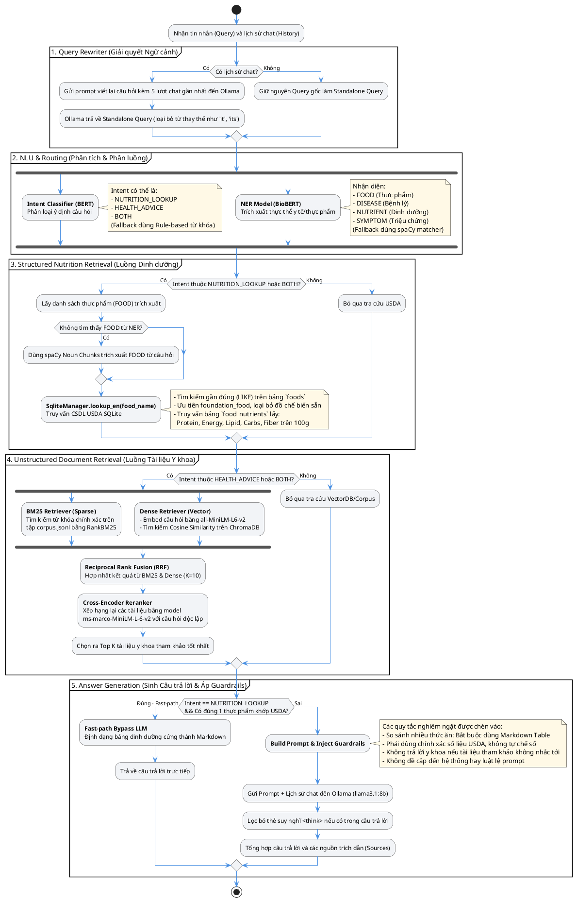
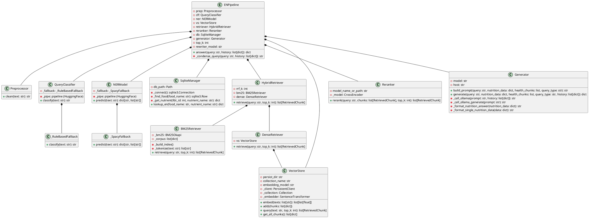

# HEALTHCARE-RAG Detailed Pipeline Workflow

Tài liệu này mô tả chi tiết cách hoạt động của quy trình **RAG (Retrieval-Augmented Generation)** trong dự án **HEALTHCARE-RAG**, bao gồm sơ đồ luồng hoạt động (Activity Diagram) và sơ đồ cấu trúc lớp (Class Diagram).

---

## 1. Luồng Hoạt động Chi tiết của RAG (Activity Diagram)

Quy trình RAG được thiết kế tối ưu với khả năng định tuyến thông minh (Routing), xử lý ngữ cảnh lịch sử hội thoại, truy xuất cơ sở dữ liệu có cấu trúc kết hợp với cơ sở dữ liệu không cấu trúc, xếp hạng lại (Reranking) và áp dụng các quy tắc kiểm soát an toàn (Guardrails) để chống ảo giác thông tin y khoa.

---

## 2. Sơ đồ các Lớp xử lý RAG trong Python (Class Diagram)

Sơ đồ lớp dưới đây thể hiện cấu trúc mã nguồn Python trong thư mục `src/`, quản lý việc phân loại ý định, trích xuất thực thể, truy xuất dữ liệu từ các kho và tổng hợp lời giải.

