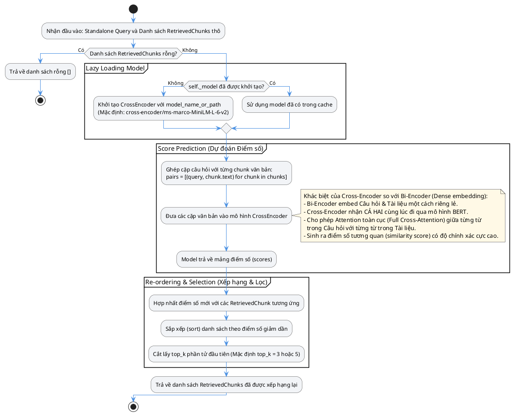
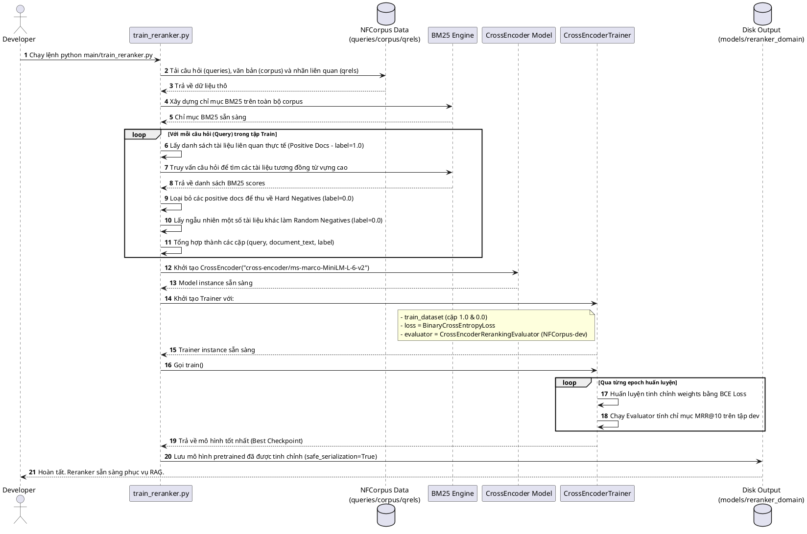
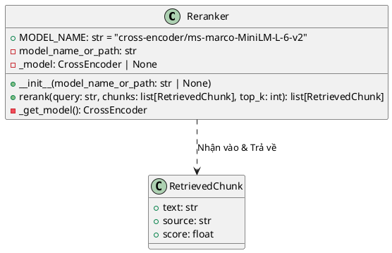

# HEALTHCARE-RAG Cross-Encoder Reranker Workflow

Tài liệu này mô tả chi tiết cách thức hoạt động, kiến trúc lớp và luồng xử lý dữ liệu của cấu phần **Reranker** trong hệ thống **HEALTHCARE-RAG**.

---

## 1. Sơ đồ Hoạt động tại Runtime (Activity Diagram)

Mô tả luồng xếp hạng lại (reranking) các tài liệu thô được trả về từ bộ lọc truy xuất lai (Hybrid Retrieval).

---

## 2. Quy trình Huấn luyện Mô hình Reranker (Sequence Diagram)

Mô tả quy trình huấn luyện tinh chỉnh (Fine-tuning) mô hình Cross-Encoder để tối ưu hóa khả năng hiểu thuật ngữ y tế/dinh dưỡng từ tập dữ liệu **NFCorpus** (sử dụng mã nguồn `main/train_reranker.py`).

---

## 3. Cấu trúc Lớp Reranker (Class Diagram)

